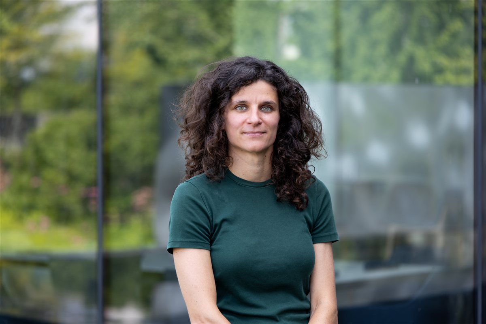

::: {.people-grid .pi-grid}

<h5 class="card-title">Judith Hoeller</h5>

Principal Investigator

Judith is a theoretical and computational scientist who uses her background in mathematics and physics to study how the brain processes visual information. She earned her undergrad and Master's degrees at ETH Zurich, completed a PhD in theoretical condensed-matter physics at Yale, and moved into systems neuroscience as a postdoc at HHMI Janelia Research Campus. Outside the sedentary life of a theorist, she enjoys moving by hiking, biking, or playing tennis.

<a href="../assets/JH_CV_2026.pdf">CV</a> · <a href="https://scholar.google.com/citations?user=FicZM4wAAAAJ&amp;hl=en">Google Scholar</a> · <a href="https://orcid.org/0009-0004-7261-4156">ORCID</a>

:::

## Current members

::: {.people-grid}

<h5 class="card-title">You</h5>

:::

<!-- To add a member, copy one whole `
 … 
` block above and edit the photo, name, role, bio, and links. Keep every HTML tag flush to the left margin — indenting a line by 4+ spaces makes it render as literal text. -->
