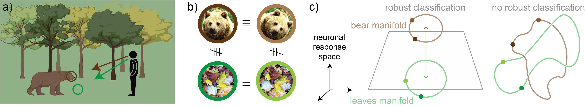
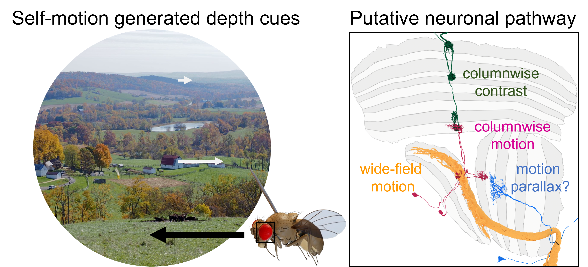

We study how visual systems—biological and artificial—represent a moving, three-dimensional world. Projects span building new theories, developing computational models, and linking them to experimental data, such as Calcium imaging of single neurons, electron microscopy of full brains, and artificial neural networks. 
We also work on adiabatic transport and geometric phases in non-Hermitian systems.
[Join us](join.qmd) if you're interested in working on these problems.

## The Geometry of Neural Manifolds underlying 3D Vision

Perceiving a 3D world feels effortless, yet the brain must infer 3D structure from 2D images entering our eyes. These 2D images undergo continuous structured deformations (projective transformations) as an animal travels through the world. We study how neuronal populations process these image transformations by forming low-dimensional neural manifolds to support both stable object recognition and accurate depth perception.

**Background paper:** Hoeller, J., Zhong, L., Heinrich, L., Saalfeld, S., Pachitariu, M., & Romani, S. (2024). [Equivariant neuronal populations enable simultaneous tuning and invariance](https://www.biorxiv.org/content/10.1101/2024.08.02.606398v2). *bioRxiv*.

{width=100% fig-alt="Schematic of view-invariant object recognition and neural manifolds"}

**(a)** As an observer moves through a scene, the same object (a bear) and background (leaves) are seen from different viewpoints, producing different 2D images. **(b)** Robust recognition requires treating different views of the same object as equivalent, while keeping views of different objects distinct. **(c)** In neuronal response space, all views of an object form a low-dimensional manifold. When the bear and leaves manifolds are separable (left), a linear readout can classify objects robustly across viewpoints; when they are entangled (right), it cannot.

## Mechanistic Models of Motion Parallax

Mechanistic understanding requires knowing how individual neurons wire together into functional circuits. Complete connectomes (neuronal wiring diagrams), such as those of *Drosophila melanogaster*, now let us trace how sensory input gets distributed and progressively reshaped by neuronal circuits. We investigate how the fly visual system computes relative distance from motion parallax by integrating motion signals at different scales. By adding proprioceptive feedback from the animal's own movements, flies could also estimate the absolute distance of an object.

**Background papers:**

- Nern, A., Loesche, F., Takemura, S., ... Hoeller, J., ... Reiser, M. B. (2025). [Connectome-driven neural inventory of a complete visual system](https://www.nature.com/articles/s41586-025-08746-0). *Nature*, 641, 1225–1237.
- Hoeller, J., Zhao, A., Nern, A., Rogers, E. M., Romani, S., & Reiser, M. B. (2026). [The organization of visual pathways in the *Drosophila* brain](https://www.cell.com/cell/fulltext/S0092-8674(26)00941-4). *Cell*, 189, 5552–5570.

:::: {.columns}

::: {.column width="50%"}
{width=100% fig-alt="Self-motion generated depth cues and a putative neuronal pathway for motion parallax in the fly visual system"}
:::

::: {.column width="5%"}
:::

::: {.column style="width:45%; align-self: center;"}
**Left:** As a fly moves, nearby objects sweep across its eye faster than distant ones (motion parallax), providing a cue to depth. **Right:** A putative neuronal pathway in the fly optic lobe: columnwise contrast and columnwise motion signals are combined with wide-field motion, potentially enabling neurons that encode motion parallax.
:::

::::

## Geometric Deep Learning for Biological and Artificial Vision

We aim to make artificial neural networks more interpretable and biologically realistic by imposing biological constraints. In particular, we use the framework of geometric deep learning to incorporate constraints on the geometry of neural manifolds. With access to the full connectivity and activity of artificial networks, we study how different geometries impact the network's output. 
